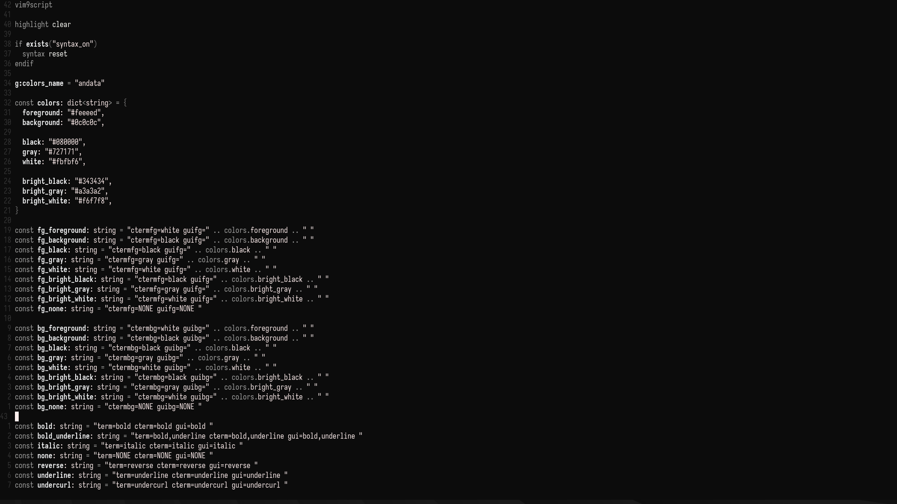

# yae.vim
A dark color scheme for Vim inspired by Yozakura (cherry blossoms illuminated at night)



## Installation
Install with your preferred plugin manager.
Using [vim-plug](https://github.com/junegunn/vim-plug):
```vim
Plug '9yokuro/yae.vim'
```
Add the following line to your `vimrc`:
```vim
colorscheme yae
```
